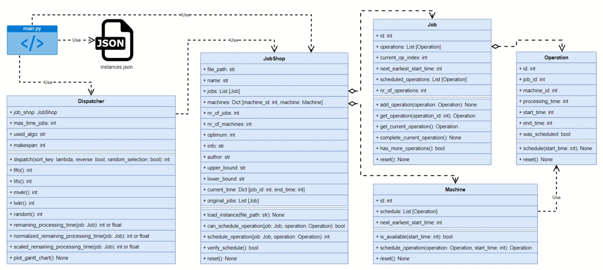

# Job Shop Scheduling

This repository contains a simple framework for Job Shop Scheduling with the following structure and classes:



The ```instances.json```-file and some of the benchmark instances found here is based on the following repository: https://github.com/tamy0612/JSPLIB

## Install

You need at least Python Version 3.10.x to run this code. In our case, we used Python Version 3.10.9.

### Venv

- Create a virtual environment: ```python -m venv venv``` or any other package manager like Conda.
- Install the python packages: ```pip install -r requirements.txt``` (We only use 2 packages so far: numpy and matplotlib)
- Activate environment: ```source venv/bin/activate```
- Deactivate environment: ```deactivate```

### Conda

- Basic installation: ```conda env create -f environment-cpu.yml```. This will create a Conda environment called ```job-shop-scheduling```.
- Updating: ```conda env update --file environment-cpu.yml --prune```
- Activate environment: ```conda activate job-shop-scheduling```
- Deactivate environment: ```conda deactivate```

## Usage

```
usage: main.py [-h] [--input INPUT] [--output OUTPUT] [--algorithm ALGORITHM] [--show_plots] [--show_instances] [--verify_instances]

Job-Shop-Scheduling

options:
  -h, --help            show this help message and exit
  --input INPUT, -i INPUT
                        Input File
  --output OUTPUT, -o OUTPUT
                        csv Schedule File
  --algorithm ALGORITHM, -a ALGORITHM
                        algorithm choice from [fifo, lifo, mwkr, lwkr, random]
  --show_plots, -sp     Show Gantt chart plots after each dispatching rule. Default is False and only saves plots.
  --show_instances, -si
                        Show all available instances from instances.json
  --verify_instances, -vi
                        Verify all instances present in instances.json
```

## Example

- Execute all available Dispatching Rules on instance ```ta01```: ```python -m main -i ta01 -a all```
Above example should result in the following output:

```
Dispatching rule: FIFO
Makespan for instance data/taillard/ta01.txt using FIFO: 1486
Verification of FIFO schedule: True
Dispatching rule: LIFO
Makespan for instance data/taillard/ta01.txt using LIFO: 9873
Verification of LIFO schedule: True
Dispatching rule: MWKR
Makespan for instance data/taillard/ta01.txt using MWKR: 1664
Verification of MWKR schedule: True
Dispatching rule: LWKR
Makespan for instance data/taillard/ta01.txt using LWKR: 9873
Verification of LWKR schedule: True
Dispatching rule: Random
Makespan for instance data/taillard/ta01.txt using RANDOM: 2688
Verification of RANDOM schedule: True
```

## Extra

Besides the common benchmark files found in```data```, you can also generate your own instances based on the approach by Taillard and Demirkol in the file ```src/generators.py```